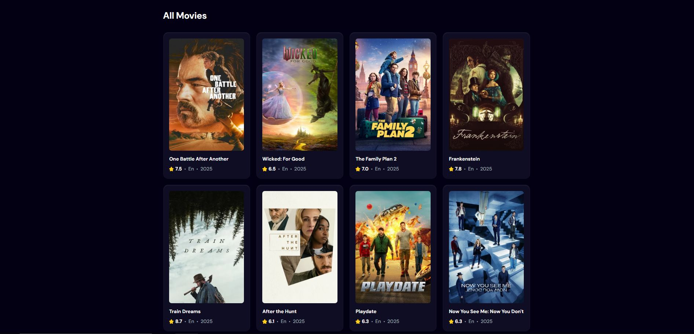
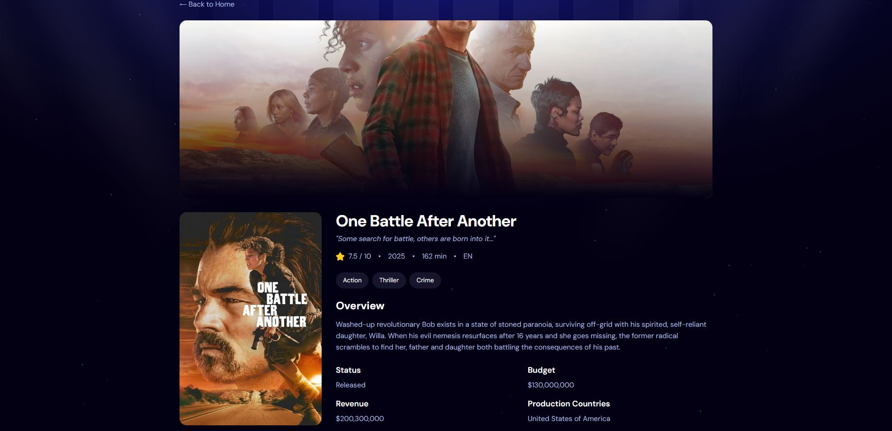

# 🎬 MovieHub - Full-Stack Movie Search Application

A modern, full-stack web application for discovering and exploring movies using the TMDB API. Built with React, Spring Boot, and PostgreSQL, fully containerized with Docker and deployed on Railway.

[](https://bescher-moviehub.up.railway.app)
[](https://github.com/Bescher-Kilani/MovieWebApp)


 
 

---

## 🚀 Features

- **🔍 Movie Search** - Search through thousands of movies from TMDB database
- **🔥 Trending Movies** - View top 5 most searched movies (tracked in backend)
- **📊 Detailed Movie Info** - View ratings, cast, runtime, budget, revenue, and more
- **🎨 Modern UI** - Responsive design with Tailwind CSS
- **⚡ Fast & Reliable** - Nginx-powered frontend with optimized caching
- **🔒 Secure** - CORS configuration, health checks, and production-ready setup
- **🚀 CI/CD Pipeline** - Automatic deployment to Railway on every push to main branch

---

## 🛠️ Tech Stack

### **Frontend**
- **React 19** - Latest React with Hooks
- **Vite** - Lightning-fast build tool
- **Tailwind CSS 4** - Modern utility-first CSS
- **React Router 7** - Client-side routing
- **Nginx** - Production web server

### **Backend**
- **Spring Boot 3.5** - Java REST API
- **JPA/Hibernate** - ORM for database operations
- **PostgreSQL 16** - Relational database
- **Maven** - Dependency management
- **Lombok** - Reduce boilerplate code

### **DevOps**
- **Docker** - Containerization
- **Docker Compose** - Multi-container orchestration
- **Railway** - Cloud deployment platform
- **CI/CD** - Automatic deployment on git push

---

## 📦 Architecture

```
┌─────────────────┐      ┌─────────────────┐      ┌─────────────────┐
│   React + Vite  │      │  Spring Boot    │      │   PostgreSQL    │
│   (Port 80)     │────▶│   (Port 8080)   │─────▶│   (Port 5432)   │
│   Nginx Server  │      │   REST API      │      │    Database     │
└─────────────────┘      └─────────────────┘      └─────────────────┘
        │                         │                         │
        └─────────────────────────┴─────────────────────────┘
                              Railway Cloud
```

---

## 🐳 Docker Setup

This project uses **dual Dockerfile strategy** to support both local development and cloud deployment:

### **Why Two Dockerfiles?**

#### **1. For Local Development (`Dockerfile.local`)**
- Used by `docker-compose.yml`
- Build context: Inside service directory (`./Backend`, `./Frontend`)
- Optimized for fast local iteration
- Paths are **relative** to service folder

#### **2. For Railway Deployment (`Dockerfile`)**
- Used by Railway's automatic build
- Build context: Repository root
- Optimized for cloud deployment
- Paths include directory prefix (`Backend/src`, `Frontend/nginx.conf`)

### **Example: Backend Dockerfiles**

**`Backend/Dockerfile.local`** (for docker-compose):
```dockerfile
COPY pom.xml .           # ✅ Relative path
COPY src ./src           # ✅ Relative path
```

**`Backend/Dockerfile`** (for Railway):
```dockerfile
COPY Backend/pom.xml .       # ✅ Absolute path from root
COPY Backend/src ./src       # ✅ Absolute path from root
```

This approach allows seamless development locally while maintaining Railway compatibility! 🎯

---

## 🚀 Quick Start

### **Prerequisites**
- Docker Desktop (or Docker Engine + Docker Compose)
- Git
- TMDB API Key ([Get it here](https://www.themoviedb.org/settings/api))

### **1. Clone the Repository**
```bash
git clone https://github.com/Bescher/MovieWebApp.git
cd MovieWebApp
```

### **2. Configure Environment Variables**
Create a `.env` file in the root directory:

```env
# Database
DB_PASSWORD=your_secure_password

# Frontend
VITE_API_URL=http://localhost:8080
VITE_TMDB_API_KEY=your_tmdb_api_key_here

# pgAdmin
PGADMIN_EMAIL=admin@movieapp.com
PGADMIN_PASSWORD=your_pgadmin_password
```

### **3. Start with Docker Compose**
```bash
# Build and start all services
docker-compose up --build -d

# View logs
docker-compose logs -f

# Stop all services
docker-compose down
```

### **4. Access the Application**
- **Frontend**: http://localhost
- **Backend API**: http://localhost:8080
- **Backend Health**: http://localhost:8080/actuator/health
- **pgAdmin**: http://localhost:5050

---

## 🌐 Deployment

### **Railway Deployment**

This project is configured for automatic deployment on Railway:

1. **Fork this repository**
2. **Connect to Railway**:
   - Go to [Railway](https://railway.app)
   - Create new project → Deploy from GitHub
   - Select your forked repository
3. **Add Services**:
   - Add PostgreSQL database
   - Add Backend service (detects `Backend/Dockerfile`)
   - Add Frontend service (detects `Frontend/Dockerfile`)
4. **Configure Environment Variables**:

   **Backend:**
   ```
   SPRING_DATASOURCE_URL=postgresql://...
   SPRING_DATASOURCE_USERNAME=postgres
   SPRING_DATASOURCE_PASSWORD=...
   FRONTEND_URL=https://your-frontend.up.railway.app
   ```

   **Frontend:**
   ```
   VITE_API_URL=https://your-backend.up.railway.app
   VITE_TMDB_API_KEY=your_tmdb_api_key
   ```

5. **Deploy**: Push to `main` branch → Automatic deployment! 🚀

### **CI/CD Pipeline**
Every push to the `main` branch triggers:
- Automatic Docker build on Railway
- Deployment to production environment
- Health checks to verify deployment
- Zero-downtime rolling updates

### **⚡ Serverless Mode (Cost Optimization)**

Railway's Serverless feature automatically sleeps inactive services to reduce costs:

**How it works:**
- Services sleep after **10 minutes of inactivity** (no outbound traffic)
- First request after sleep causes a **~20 second cold start**
- Subsequent requests are instant (normal response time)
- Automatically wakes on incoming traffic

**What counts as activity:**
- HTTP requests (inbound/outbound)
- Database connections
- Private network traffic
- Any outbound packets

**Important Notes:**
- ⏱️ **Cold Start Time**: ~20 seconds on first request after sleep
- 💰 **Cost Savings**: Only pay when service is active
- 🔄 **Automatic**: No configuration needed
- 📊 **Monitoring**: Check Railway Metrics tab for sleep/wake events

---

## 📁 Project Structure

```
MovieWebApp/
├── Backend/                      # Spring Boot REST API
│   ├── src/
│   │   └── main/
│   │       ├── java/.../
│   │       │   ├── Controller/   # REST endpoints
│   │       │   ├── Service/      # Business logic
│   │       │   ├── Repository/   # Database access
│   │       │   ├── Entity/       # JPA entities
│   │       │   └── DTO/          # Data transfer objects
│   │       └── resources/
│   │           └── application.properties
│   ├── Dockerfile                # Production (Railway)
│   ├── Dockerfile.local          # Local development
│   └── pom.xml                   # Maven dependencies
│
├── Frontend/                     # React + Vite
│   ├── src/
│   │   ├── components/           # React components
│   │   │   ├── Home.jsx          # Main page
│   │   │   ├── MovieCard.jsx     # Movie card
│   │   │   ├── MovieDetails.jsx  # Detail page
│   │   │   ├── Search.jsx        # Search bar
│   │   │   └── Spinner.jsx       # Loading spinner
│   │   ├── api.js                # API calls
│   │   ├── config.js             # Configuration
│   │   ├── App.jsx               # Router setup
│   │   └── index.css             # Tailwind styles
│   ├── public/                   # Static assets
│   ├── nginx.conf                # Nginx configuration
│   ├── Dockerfile                # Production (Railway)
│   ├── Dockerfile.local          # Local development
│   ├── package.json
│   └── vite.config.js
│
├── images/                       # README screenshots
│   ├── Homepage.JPG              # Home page screenshot
│   ├── Trendingsection.JPG       # Trending section screenshot
│   └── Moviedetails.JPG          # Movie details screenshot
│
├── docker-compose.yml            # Local development setup
├── .railwayignore                # Railway deployment ignore
├── .gitignore
└── README.md
```

---

## 🔧 API Endpoints

### **Backend REST API**

| Method | Endpoint | Description |
|--------|----------|-------------|
| `POST` | `/api/movies/search` | Track movie search |
| `GET` | `/api/movies/trending` | Get top 5 trending movies |
| `GET` | `/actuator/health` | Health check endpoint |

### **Request/Response Examples**

**Track Search:**
```bash
POST /api/movies/search
Content-Type: application/json

{
  "searchTerm": "Inception",
  "movieId": "27205",
  "posterUrl": "https://image.tmdb.org/t/p/w500/..."
}
```

**Get Trending:**
```bash
GET /api/movies/trending

Response:
[
  {
    "id": 1,
    "searchTerm": "Inception",
    "movieId": "27205",
    "count": 42,
    "posterUrl": "...",
    "createdAt": "2024-11-20T10:00:00",
    "updatedAt": "2024-11-22T15:30:00"
  },
  ...
]
```

**Health Check:**
```bash
GET /actuator/health

Response:
{
  "status": "UP",
  "components": {
    "db": {
      "status": "UP"
    },
    "diskSpace": {
      "status": "UP"
    }
  }
}
```

---

## 🏥 Health Monitoring

### **Check Application Health**

**Local Development:**
```bash
# Backend health check
curl http://localhost:8080/actuator/health

# Check if frontend is serving
curl http://localhost

# Check database connection (via pgAdmin)
# Visit: http://localhost:5050
```

**Production (Railway):**
```bash
# Backend health check
curl https://backend-production-4178.up.railway.app/actuator/health

# Frontend availability
curl https://bescher-moviehub.up.railway.app
```

### **Health Check Components**

The Spring Boot Actuator provides detailed health information:

- **Database Connection** - PostgreSQL connection status
- **Disk Space** - Available disk space on server
- **Custom Health Indicators** - Add your own health checks

### **Monitoring in Railway**

Railway provides built-in monitoring:
1. Go to Railway Dashboard → Your Service
2. Click on **Metrics** tab
3. View:
   - CPU Usage
   - Memory Usage
   - Network Traffic
   - Request Logs
   - Error Rates

---

## 🎨 Environment Variables

### **Frontend (`Frontend/.env.local`)**
```env
VITE_API_URL=http://localhost:8080
VITE_TMDB_API_KEY=your_tmdb_api_key
```

### **Backend (`Backend/src/main/resources/application.properties`)**
```properties
spring.datasource.url=${SPRING_DATASOURCE_URL}
spring.datasource.username=${SPRING_DATASOURCE_USERNAME}
spring.datasource.password=${SPRING_DATASOURCE_PASSWORD}
frontend.url=${FRONTEND_URL:http://localhost}
```

---

## 🧪 Development

### **Run Backend Locally (without Docker)**
```bash
cd Backend
./mvnw spring-boot:run

# Check health after startup
curl http://localhost:8080/actuator/health
```

### **Run Frontend Locally (without Docker)**
```bash
cd Frontend
npm install
npm run dev
```

### **Database Access**
- **pgAdmin**: http://localhost:5050
- **Direct Connection**:
  ```
  Host: localhost
  Port: 5432
  Database: moviedb
  Username: postgres
  Password: (from .env)
  ```

---

## 🐛 Troubleshooting

### **Docker Compose Issues**

**Problem**: `Backend/src: not found`
```bash
# Solution: Make sure you're using Dockerfile.local
docker-compose down
docker-compose up --build -d
```

**Problem**: Port already in use
```bash
# Find and kill process on port 8080 (Windows)
netstat -ano | findstr :8080
taskkill /PID <PID> /F

# Or change port in docker-compose.yml
```

**Problem**: Browser shows old cached version
```bash
# Hard refresh to clear cache
Windows/Linux: Ctrl + Shift + R
Mac: Cmd + Shift + R
```

**Problem**: Backend health check fails
```bash
# Check if backend is running
docker-compose ps

# View backend logs
docker-compose logs backend

# Restart backend service
docker-compose restart backend

# Verify health endpoint
curl http://localhost:8080/actuator/health
```

### **Railway Deployment Issues**

**Problem**: Environment variables not set
- Check Railway dashboard → Service → Variables
- Ensure all required variables are set

**Problem**: Build fails on Railway
- Railway uses `Dockerfile` (not `Dockerfile.local`)
- Check build logs for missing files
- Verify paths include directory prefix (`Backend/`, `Frontend/`)

**Problem**: Service shows as unhealthy
- Check Railway logs for errors
- Verify environment variables are correct
- Test health endpoint: `curl https://your-backend.up.railway.app/actuator/health`

**Problem**: Slow first request (~20 seconds)**
- This is normal behavior when Serverless mode is enabled
- Service was asleep and needs to cold start
- Subsequent requests will be instant
- To avoid: Disable Serverless in Railway settings

---

## 📊 Database Schema

```sql
CREATE TABLE movie_searches (
    id BIGSERIAL PRIMARY KEY,
    search_term VARCHAR(255) NOT NULL UNIQUE,
    movie_id VARCHAR(255) NOT NULL,
    count INTEGER NOT NULL DEFAULT 0,
    poster_url VARCHAR(500),
    created_at TIMESTAMP NOT NULL,
    updated_at TIMESTAMP
);
```

---

## 🎯 TODOs

### **Planned Features**
- [ ] **User Authentication** - Login/registration with watchlist and favorites
- [ ] **Advanced Filters** - Filter by genre, year, rating, language
- [ ] **Recommendation Engine** - AI-powered movie recommendations
- [ ] **TV Shows Support** - Expand to include TV series tracking

---

## 🙏 Acknowledgments

- [TMDB API](https://www.themoviedb.org/documentation/api) - Movie data
- [Railway](https://railway.app) - Cloud hosting
- [Tailwind CSS](https://tailwindcss.com) - CSS framework
- [Spring Boot](https://spring.io/projects/spring-boot) - Backend framework
- [React](https://react.dev) - Frontend library

---

## 📧 Contact

**Bescher Kilani**
- 🌐 GitHub: [@Bescher-Kilani](https://github.com/Bescher-Kilani)
- 📧 Email: bescherkilani@gmail.com
- 💼 LinkedIn: [Bescher Kilani](https://linkedin.com/in/bescher-kilani-34726a361)

**Project Links**
- 🔗 Repository: [https://github.com/Bescher-Kilani/MovieWebApp](https://github.com/Bescher-Kilani/MovieWebApp)
- 🚀 Live Demo: [https://bescher-moviehub.up.railway.app](https://bescher-moviehub.up.railway.app)

---

## 🌟 Star this repo if you found it helpful!

Made with ❤️ by Bescher Kilani